### Febin Renu
Hyderabad, India

Software Developer at Entarch Solutions (remote, since Jan 2026) · Software Engineering Intern / Dev Lead at Grids Apps LLC (remote, since Jul 2026)
 
Final-year CS undergrad at Karunya Institute of Technology and Sciences (2023–2027, CGPA 9.39)

 

## What I build

Systems where something has to be decided under uncertainty, and the decision has to be cheap to audit — not "call an LLM and hope," a calibrated model with a cost function and a defined point where a human takes over. A payment-recovery engine that's allowed to conclude the right move is doing nothing. A medical second opinion that withholds the findings it can't prove. A camera search that says "no" when the footage says no. Underneath the product work, plain full-stack engineering with tests and CI, because none of the above ships without it.

 

## Out-decide my model

This is a game you can play right here. Reclaim's whole argument is that a calibrated model with a cost function makes better recovery calls than "always retry." So here's a failed payment. Make the call. A toy version of Reclaim's model makes its own call on the same case, and both calls are scored by expected value at the true odds. Nobody wins on a lucky coin flip.

The model sees every field on the card. **It can't read the note.** That's your edge, if you use it.

Press a button and an issue opens with your move already filled in. Hit **Create**, and within about a minute a bot scores you against the model, updates this board and deals the next case. You need a GitHub account; that's all.

<!-- GAME:START -->

_No moves yet. The first click sets the scoreboard._
<!-- GAME:END -->

<b>How it's scored</b>

 

With amount **A** and true recovery probability **p**:

- **RECOVER** = p·A·(1 − c) − 0.03·A − ₹20 − (1 − p)·0.40·A. A failed retry burns goodwill. c = 0.5 when the reason is suspected fraud, because half of that money gets charged back later.
- **ESCALATE** = p′·A − 0.03·A − ₹1,200 − (1 − p′)·0.10·A, where p′ = p + 0.20·(1 − p). A human closes a fifth of the gap, catches the fraud, and costs real time.
- **LEAVE IT** = 0, on purpose.

The model's p comes from a logistic regression over the fields on the card. The true p adds the note's effect and a little noise. The model takes the best action at *its* p, then both calls are scored at the true p, and the scoreboard is the running sum.

These are synthetic cases and a toy replica of Reclaim's decision logic, not its production model. The engine is public in [`game/engine.py`](game/engine.py). Reading it to win is learning the model, which is the point.

 

## What's real, and how you can check

| Area | What's actually there | Proof |
|---|---|---|
| Applied ML | scikit-learn, XGBoost, LSTM forecasting | [AssetStream](https://github.com/febinrenu/AssetStream), [ml-loan](https://github.com/febinrenu/ml-loan), [Bitcoin-LSTM](https://github.com/febinrenu/Bitcoin-Price-Prediction-using-LSTM): public, live |
| Decision systems | calibrated logistic regression + expected-value optimization | [Reclaim](https://github.com/febinrenu/reclaim): public, 574 tests, CI. Also the game above |
| Medical imaging, verified | deletion tests, temperature scaling + conformal sets, second reader, leakage audit, hash-chained audit trail | [PARALLAX](https://github.com/febinrenu/PARALLAX): public, live, hackathon team build |
| Multi-camera video | detection, tracking, cross-camera re-ID, natural-language retrieval with evidence | [EVORA](https://github.com/febinrenu/EVORA): public, live, hackathon team build, measured on MEVA and WILDTRACK |
| Legal NLP + policy simulation | statute parsing, span-grounded rule extraction, tax microsimulation | [PRISM](https://github.com/febinrenu/PRISM): public |
| RAG research | conditional knowledge conflicts: detect, scope, compose | [ScopeCompose](https://github.com/febinrenu/ScopeCompose): public, research in progress, no results to quote yet. Plus Hugging Face Agents and LangChain/LlamaIndex RAG coursework |
| Full-stack product | Next.js/Django/Node, Postgres/Redis/MongoDB, Docker | 7 live deployments (two are static demos of local systems), listed below |
| Agentic AI / LLM orchestration | AWS Bedrock multi-agent system, confidence-based routing | current role. Real, but the code is a client's, not public |
| Cloud infra (Terraform, K8s, Helm) | full IaC pipeline with CI/CD, monitoring | resume project (PromptForge): live demo, repo not public |
| Computer vision | customer-behavior modeling project | Intel Unnati industrial training, Feb–Apr 2025. No public repo |
| Research curiosity | measuring whether prompt instability costs inference energy | [Computational Entropy Lab](https://github.com/febinrenu/comp_entropy): public |

I'd rather show you this table than let "AI Engineer" do the talking. Some of the above I can point you straight at the code for. Some of it I can't, and I'd rather say so than blur the line.

 

## EVORA

Ask a set of cameras a question in plain language. [Live](https://evora-ivory.vercel.app), [source](https://github.com/febinrenu/EVORA). Footage is indexed once. Then *"did a red car pass the main gate in the last hour?"* comes back with a camera, a time, a playable clip with the object circled, and the reasons. When it meets a place it has never heard of ("main gate"), it asks once, you draw the line, and it never asks again. When the footage doesn't support an answer, it says so and shows the nearest miss. It runs on one laptop with an 8 GB GPU. With the privacy switch on, nothing leaves the machine and faces are blurred. Measured on one MEVA site: Hit@5 of 0.72 on dev and 0.69 on test, and negative precision of 1.00 on dev, where a frame-similarity baseline scores 0.00. That same baseline matches it on plain object presence, the sets are small, and the repo says all of this. Hackathon team build.

 

## PARALLAX

A medical second opinion that has to prove every finding before a doctor sees it. [Live](https://parallax-two-xi.vercel.app), [source](https://github.com/febinrenu/PARALLAX). It reads a chest X-ray, brain MRI, skin dermoscopy or bone X-ray along with the clinical notes, and every finding has to survive eight independent checks:

1. It has to point at something.
2. Blurring what it points at has to lower its confidence.
3. It has to hold up under eight perturbations.
4. It gets temperature scaling and conformal sets.
5. An independent second reader (MedGemma) looks too.
6. The notes are checked with exact character spans, and any instructions injected into them are quarantined.
7. The report sentences are templates that code fills from evidence ids.
8. Every step joins a SHA-256 hash chain.

The uncomfortable number is the one I'd lead with: only about 42% of brain and 44% of skin findings pass the deletion test, so the rest are withheld rather than shown. A leakage audit found that 71% of an "external" brain set were near-duplicates of the training data. Only the 1,644 clean images count. Decision support only, not a medical device. Hackathon team build.

 

## PRISM

When a language model extracts the rules of an Indian tax statute, does simulating those rules reach the same policy conclusions as an expert's coding of the same law? And when it doesn't, which clause is responsible? [Source](https://github.com/febinrenu/PRISM). Statute PDFs become a legal AST: sections, provisos, explanations and schedules, with exact offsets. Rules are extracted and grounded to exact spans, and a quote that isn't in the statute is rejected. Those rules become executable tax parameters and run on a weighted taxpayer population that reproduces the official Income Tax Return Statistics. The output is revenue, decile effective rates, Gini, Kakwani and Reynolds–Smolensky, across five Finance Act reforms. The visual is illustrative: it shows the kind of divergence PRISM exists to trace, not a reported result.

 

## ScopeCompose

Final-year research, two members. [Source](https://github.com/febinrenu/ScopeCompose). Conflict-aware RAG systems notice that two passages disagree and resolve it by picking the more credible source. Take "international transactions carry a 3% fee" and "fees are waived for premium cardholders." Both are true, under different scopes, so picking one silently deletes the exception, and answer-correctness metrics can't see the deletion. ScopeCompose detects conditional conflicts as their own type, recovers the conditions that govern them, and composes a scoped answer that keeps every valid branch. It also adds a metric that makes the deletion measurable: Suppression Rate. Status, honestly: the pipeline is built and has 501 tests. Annotation and live runs are in progress, so there are no results to quote yet.

 

## Reclaim

A risk-aware revenue recovery engine — [live](https://reclaim-lac-six.vercel.app), [source](https://github.com/febinrenu/reclaim). Most retry logic assumes recovering a failed payment is always worth attempting. Reclaim prices each action instead: a calibrated model estimates recovery probability, an expected-value calculation weighs it against the cost of trying, and the system is free to decide the correct answer is to leave it alone. TypeScript, Next.js, PostgreSQL, Razorpay, idempotent webhooks, a human-escalation budget for the cases too risky to automate.

 

## AssetStream

An AI-powered Equipment-as-a-Service platform — [live](https://assetstream-frontend.onrender.com), [source](https://github.com/febinrenu/AssetStream). Simulates lease originations, IoT-driven usage billing, and end-of-lease remarketing for leased industrial equipment. A Django + Celery + Redis engine turns live telemetry into invoices on a billing cycle; a scikit-learn regression model prices resale value so the remarketing call isn't a guess. Next.js/TypeScript frontend, Groq LLM integration, fully Dockerized.

 

## Computational Entropy Lab

A FastAPI/React research platform testing a specific hypothesis: does semantic instability in a prompt carry a measurable inference-energy cost? [Source](https://github.com/febinrenu/comp_entropy). It's explicit about the line between real and synthetic — demo data is flagged `measurement_source: synthetic_simulation` in the API so it's never mistaken for a result. Built because the question was interesting, not because anyone asked for it.

 

## Real, not yet public

**[PromptForge](https://prompt-forge-frontend.vercel.app)** — a prompt discovery/testing platform across multiple LLMs, backed by a 10-service NestJS microservices architecture on a Terraform-provisioned K3s cluster with Helm, HPA autoscaling, and a full CI/CD pipeline (lint → test → Docker → Trivy scan → zero-downtime deploy). Repo is private; the live app is the proof.

**AskVid-Pro** — answers free-form questions about short videos with timestamped citations, built on a 4-bit QLoRA-fine-tuned Video-LLaMA2 with OpenCLIP/FAISS retrieval, evaluated on MSRVTT-QA and NEXT-QA. Deployed via Streamlit on Hugging Face Spaces; repo is private.

 

## Other builds

- **[QuantroCode](https://github.com/febinrenu/QuantroCode)** — multi-tenant POS/ERP SaaS in PHP/Vue: custom domains, pharmacy batch tracking, POS hardware integration, client billing portal.
- **BlogHaven** — MERN blogging platform, role-based auth, moderation workflows, admin analytics. [Live](https://bloghaven-draft.netlify.app).
- **[Bitcoin-LSTM](https://github.com/febinrenu/Bitcoin-Price-Prediction-using-LSTM)** — early ML work: an LSTM forecaster evaluated on MSE/RMSE, not a trading signal.

 

## Toolbox

**Languages**

**Frontend**

**Backend & APIs**

**AI & ML**

**Data & infra**

**Cloud & DevOps**

**Tools**

 

**SMAHI-ER**, IEEE, June 2026 — a multi-agent hypergraph framework for resilient human-machine manufacturing. [10.1109/IEHNS68708.2026.11607072](https://doi.org/10.1109/IEHNS68708.2026.11607072)
First Rank, 9.54 SGPA (May 2024) · Second Rank, 9.42 SGPA (Dec 2023) — Karunya Institute

[GitHub](https://github.com/febinrenu) · [LinkedIn](https://www.linkedin.com/in/febin-renu/) · [febinrenu7@gmail.com](mailto:febinrenu7@gmail.com)
