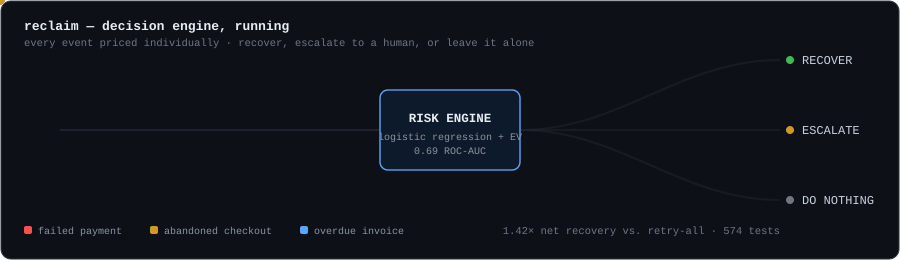

### Febin Renu
Coimbatore, India

Development Lead at Entarch Solutions (remote, since Jan 2026) · final-year CS undergrad at Karunya Institute of Technology and Sciences (2023–2027, CGPA 9.39)

 

## What I build

Systems where something has to be decided under uncertainty, and the decision has to be cheap to audit — not "call an LLM and hope," a calibrated model with a cost function and a defined point where a human takes over. A payment-recovery engine that's allowed to conclude the right move is doing nothing. A leasing platform that has to price equipment it's never seen retire. Underneath the product work, plain full-stack engineering with tests and CI, because none of the above ships without it.

 

## What's real, and how you can check

| Area | What's actually there | Proof |
|---|---|---|
| Applied ML | scikit-learn, XGBoost, LSTM forecasting | [AssetStream](https://github.com/febinrenu/AssetStream), [ml-loan](https://github.com/febinrenu/ml-loan), [Bitcoin-LSTM](https://github.com/febinrenu/Bitcoin-Price-Prediction-using-LSTM) — public, live |
| Decision systems | calibrated logistic regression + expected-value optimization | [Reclaim](https://github.com/febinrenu/reclaim) — public, 574 tests, CI |
| Full-stack product | Next.js/Django/Node, Postgres/Redis/MongoDB, Docker | 5 live deployments, listed below |
| Agentic AI / LLM orchestration | AWS Bedrock multi-agent system, confidence-based routing | current role — real, code is a client's, not public |
| Cloud infra (Terraform, K8s, Helm) | full IaC pipeline with CI/CD, monitoring | resume project (PromptForge) — live demo, repo not public |
| RAG, LangChain, agent frameworks | hands-on coursework, not shipped code | Hugging Face Agents course, LangChain/LlamaIndex RAG course — training, not a repo |
| Computer vision | customer-behavior modeling project | Intel Unnati industrial training, Feb–Apr 2025 — no public repo |
| Research curiosity | measuring whether prompt instability costs inference energy | [Computational Entropy Lab](https://github.com/febinrenu/comp_entropy) — public |

I'd rather show you this table than let "AI Engineer" do the talking. Some of the above I can point you straight at the code for. Some of it I can't, and I'd rather say so than blur the line.

 

## Reclaim

A risk-aware revenue recovery engine — [live](https://reclaim-lac-six.vercel.app), [source](https://github.com/febinrenu/reclaim). Most retry logic assumes recovering a failed payment is always worth attempting. Reclaim prices each action instead: a calibrated model estimates recovery probability, an expected-value calculation weighs it against the cost of trying, and the system is free to decide the correct answer is to leave it alone. TypeScript, Next.js, PostgreSQL, Razorpay, idempotent webhooks, a human-escalation budget for the cases too risky to automate.

 

## AssetStream

An AI-powered Equipment-as-a-Service platform — [live](https://assetstream-frontend.onrender.com), [source](https://github.com/febinrenu/AssetStream). Simulates lease originations, IoT-driven usage billing, and end-of-lease remarketing for leased industrial equipment. A Django + Celery + Redis engine turns live telemetry into invoices on a billing cycle; a scikit-learn regression model prices resale value so the remarketing call isn't a guess. Next.js/TypeScript frontend, Groq LLM integration, fully Dockerized.

 

## Real, not yet public

**[PromptForge](https://prompt-forge-frontend.vercel.app)** — a prompt discovery/testing platform across multiple LLMs, backed by a 10-service NestJS microservices architecture on a Terraform-provisioned K3s cluster with Helm, HPA autoscaling, and a full CI/CD pipeline (lint → test → Docker → Trivy scan → zero-downtime deploy). Repo is private; the live app is the proof.

**AskVid-Pro** — answers free-form questions about short videos with timestamped citations, built on a 4-bit QLoRA-fine-tuned Video-LLaMA2 with OpenCLIP/FAISS retrieval, evaluated on MSRVTT-QA and NEXT-QA. Deployed via Streamlit on Hugging Face Spaces; repo is private.

 

## Other builds

- **[QuantroCode](https://github.com/febinrenu/QuantroCode)** — multi-tenant POS/ERP SaaS in PHP/Vue: custom domains, pharmacy batch tracking, POS hardware integration, client billing portal.
- **BlogHaven** — MERN blogging platform, role-based auth, moderation workflows, admin analytics. [Live](https://bloghaven-draft.netlify.app).
- **[Computational Entropy Lab](https://github.com/febinrenu/comp_entropy)** — a FastAPI/React research platform testing whether semantic instability in a prompt has a measurable energy cost. Built because the question was interesting.

 

---

**SMAHI-ER**, IEEE, June 2026 — a multi-agent hypergraph framework for resilient human-machine manufacturing. [10.1109/IEHNS68708.2026.11607072](https://doi.org/10.1109/IEHNS68708.2026.11607072)
First Rank, 9.54 SGPA (May 2024) · Second Rank, 9.42 SGPA (Dec 2023) — Karunya Institute

[GitHub](https://github.com/febinrenu) · [LinkedIn](https://www.linkedin.com/in/febin-renu/) · [febinrenu7@gmail.com](mailto:febinrenu7@gmail.com)
